# WinLauncher v2.0 - Kullanım Kılavuzu

---

## İçindekiler

1. [Giriş](#giriş)
2. [Kurulum](#kurulum)
3. [Ana Ekran](#ana-ekran)
4. [Sekme Yönetimi](#sekme-yönetimi)
5. [Öğe Yönetimi](#öğe-yönetimi)
6. [Manuel Sıralama Ekranı](#manuel-sıralama-ekranı)
7. [Kopyala-Taşı Ekranı](#kopyala-taşı-ekranı)
8. [Ayarlar Ekranı](#ayarlar-ekranı)
9. [Araçlar Menüsü](#araçlar-menüsü)
10. [Yardım Menüsü](#yardım-menüsü)
11. [Hakkında Ekranı](#hakkında-ekranı)
12. [Lisans Ekranı](#lisans-ekranı)
13. [Dil Desteği](#dil-desteği)
14. [İpuçları ve Yedekleme](#ipuçları-ve-yedekleme)
15. [SSS](#sss)
16. [Teknik Destek](#teknik-destek)

---

## Giriş

**WinLauncher**, Windows için geliştirilmiş modern ve kullanıcı dostu bir **uygulama başlatıcı**dır.
Masaüstünüzü düzenli tutmanıza ve sık kullandığınız programlara, dosyalara ve klasörlere hızlıca erişmenize yardımcı olur.

### Özellikler

| Özellik | Açıklama |
|---|---|
| Sekme Yönetimi | Uygulamalarınızı kategorilere ayırın |
| Tek / Çift Tik | Başlatma modunu seçin |
| Arama | Öğelerinizde hızla arama yapın |
| Çok Dilli | Türkçe ve İngilizce arayüz |
| Sistem Araçları | 13 adet yerleşik sistem aracı |
| Taşınabilir | Kurulum gerektirmez, USB'den çalışır |
| Manuel Sıralama | Öğe sırasını kendiniz belirleyin |
| Kopyala / Taşı | Öğeleri sekmeler arasında taşıyın |

---

## Kurulum

### Sistem Gereksinimleri

| Bileşen | Minimum |
|---|---|
| İşletim Sistemi | Windows 7 / 8 / 10 / 11 |
| .NET Framework | 4.7.2 veya üzeri |
| Disk Alanı | ~10 MB |
| RAM | 512 MB |

### Kurulum Adımları (Portable)

1. WinLauncher_v2.0_Portable.zip dosyasını indirin
2. ZIP dosyasını istediğiniz bir klasöre çıkarın
3. winLuncher.exe dosyasını çalıştırın

> Kurulum gerekmez. Program ilk çalışmada tüm gerekli dosyaları otomatik oluşturur.

### İlk Çalıştırmada Oluşturulan Dosyalar

```
winLuncher/
  winLuncher.exe
  Data/
    WinLauncher.xml       <- Öğe ve sekme verileri
  settings.ini            <- Uygulama ayarları
  assets/
    lang.ini              <- Dil dosyası
    icon/                 <- İkon kütüphanesi
    documentation/        <- Kılavuzlar
```

---

## Ana Ekran

Ana ekran, WinLauncher'ın merkezi yönetim alanıdır.

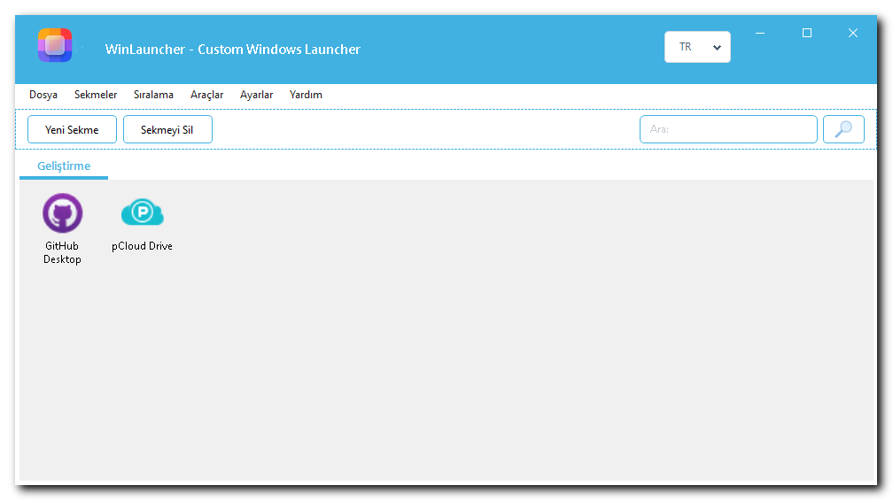

### Başlık Çubuğu

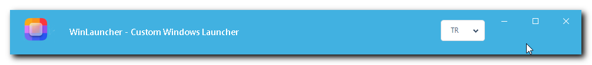

Başlık çubuğu en üstte yer alır:

| Öğe | Açıklama |
|---|---|
| WinLauncher Logosu | Sol üstteki uygulama ikonu |
| Uygulama Başlığı | "WinLauncher - Custom Windows Launcher" |
| Dil Menüsü (TR / EN) | Anlık dil değiştirme |
| Minimize (-) | Pencereyi küçültür |
| Maximize (kare) | Pencereyi büyütür |
| Kapat (X) | Programı kapatır |

> İpucu: Başlık çubuğundan tutarak pencereyi istediğiniz yere sürükleyebilirsiniz.

### Menü Çubuğu

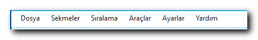

```
Dosya | Sekmeler | Sıralama | Araçlar | Ayarlar | Yardım
```

### Araç Paneli

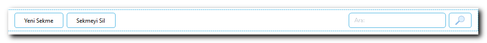

| Öğe | Açıklama |
|---|---|
| Yeni Sekme butonu | Yeni sekme oluşturur |
| Sekmeyi Sil butonu | Seçili sekmeyi siler |
| Ara metin kutusu | Öğelerde arama yapar |
| Arama butonu | Aramayı başlatır |

### Sekme Alanı

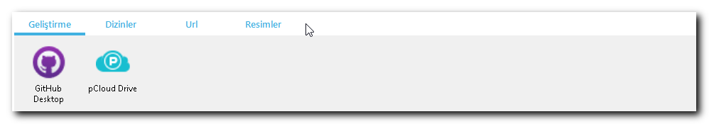

Her sekme bir kategoriyi temsil eder (örneğin: Geliştirme, Oyunlar, İş).

### Öğe Alanı (İkon Paneli)

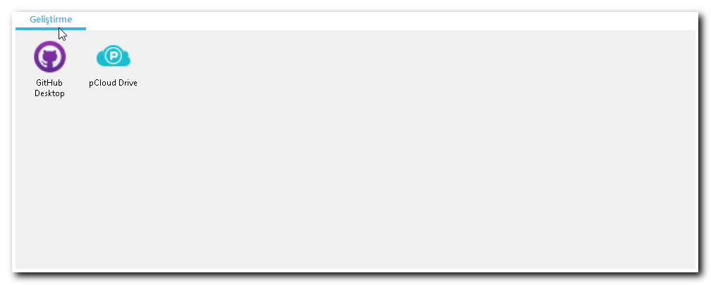

Her öğe şunlardan oluşur:
- İkon (üstte, 48x48 px)
- Ad (altta, metin)

---

## Sekme Yönetimi

### Yeni Sekme Oluşturma

Yöntem 1 - Menüden:
1. Sekmeler menüsü -> Yeni Sekme
2. Açılan pencereye sekme adını yazın (örn: "Oyunlar")
3. Tamam'a tıklayın

Yöntem 2 - Araç Panelinden:
1. Araç panelindeki Yeni Sekme butonuna tıklayın
2. Sekme adını yazın -> Tamam

Yöntem 3 - Sağ Tik:
1. Sekme çubuğuna sağ tıklayın -> Yeni Sekme

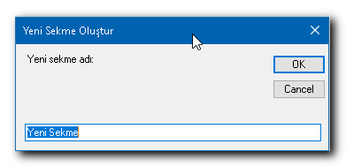

### Sekme Adını Değiştirme

1. Sekmeye sağ tıklayın -> Sekme Adını Değiştir
2. Yeni adı yazın -> Tamam

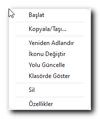

### Sekme Silme

1. Sekmeye sağ tıklayın -> Sekmeyi Sil
2. Ya da araç panelindeki Sekmeyi Sil butonuna tıklayın
3. Onay penceresinde Evet'e tıklayın

> UYARI: En az bir sekme her zaman kalmalıdır. Son sekme silinemez.

### Sekme Yenileme

Sekme içeriğini XML dosyasından yeniden yükler:
- Sekmeye sağ tıklayın -> Sekmeyi Yenile
- Ya da menüden Sekmeler -> Sekmeyi Yenile

### Sekmeler Arası Geçiş

| Yöntem | Açıklama |
|---|---|
| Tıklama | Sekme adına tıklayın |
| Tab tuşu | Sağdaki sekmeye geçer |
| Shift + < | Soldaki sekmeye geçer |
| Shift + > | Sağdaki sekmeye geçer |

---

## Öğe Yönetimi

### Öğe Ekleme (Sürükle-Bırak)

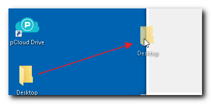

1. Dosya Gezgini veya Masaüstünden bir dosya / klasör / kısayol seçin
2. WinLauncher'daki ilgili sekmeye sürükleyip bırakın
3. Öğe otomatik eklenir, ikon otomatik algılanır

> İpucu: .lnk (kısayol) dosyaları sürüklendiğinde WinLauncher hedef uygulamayı otomatik algılar.

### Öğe Başlatma

| Mod | Nasıl? | Ayar |
|---|---|---|
| Tek Tik | İkona veya ada bir kez tıklayın | Ayarlar -> Tek Tik |
| Çift Tik | İkona veya ada çift tıklayın | Ayarlar -> Çift Tik (varsayılan) |

### Öğe Sağ Tik Menüsü

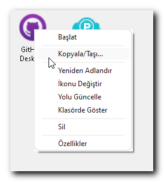

Herhangi bir öğeye sağ tıkladığınızdaki menü:

```
  Başlat
  ---
  Kopyala/Taşı...
  ---
  Yeniden Adlandır
  İkonunu Değiştir
  Yolu Güncelle
  Klasörde Göster
  ---
  Sil
  ---
  Özellikleri
```

#### Başlat
Seçili uygulamayı / dosyayı / klasörü başlatır veya açar.

#### Kopyala / Taşı
Öğeyi başka bir sekmeye kopyalar veya taşır. Bkz. Kopyala/Taşı Ekranı bölümü.

#### Yeniden Adlandır

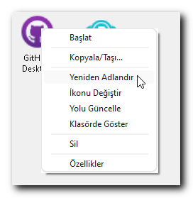

1. Yeniden Adlandır'a tıklayın
2. Yeni adı girin -> Tamam

#### İkonunu Değiştir

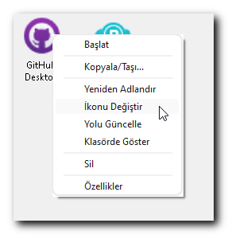

1. İkonunu Değiştir'e tıklayın
2. Desteklenen formatlarda dosya seçin: .ico, .png, .jpg, .bmp
3. İkon anında güncellenir

> İpucu: assets/icon/ klasöründeki hazır ikonları kullanabilirsiniz.

#### Yolu Güncelle
Uygulama taşındıysa dosya yolunu güncelleyin:
1. Yolu Güncelle'ye tıklayın
2. Yeni dosya konumunu seçin
3. Yol ve ikon otomatik yenilenir

#### Klasörde Göster
Öğünün bulunduğu klasörü Windows Gezgini'nde açar ve dosyayı seçili gösterir.

#### Sil
Öğeyi WinLauncher listesinden kaldırır (diskten silinmez):
1. Sil'e tıklayın -> Onay penceresinde Evet

#### Özellikleri

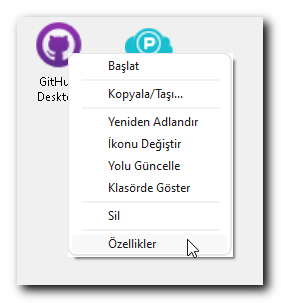

```
İsim     : Visual Studio Code
Yol      : C:\Program Files\VSCode\Code.exe
Mevcut   : Evet (Dosya)
Özel İkon: Evet
```

### Arama

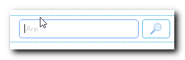

1. Araç panelindeki Ara kutusuna yazmayı başlayın
2. Ara butonuna tıklayın veya Enter'a basın
3. Öğeler ada göre filtrelenir
4. Kutuyu temizleyip tekrar aradığınızda tüm öğeler geri döner

---

## Manuel Sıralama Ekranı

Sekmedeki öğelerin sırasını elle belirleyin.

Açmak için: Menü -> Sıralama -> Manuel Sıralama...

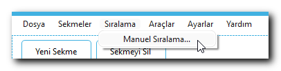

### Ekran Bileşenleri

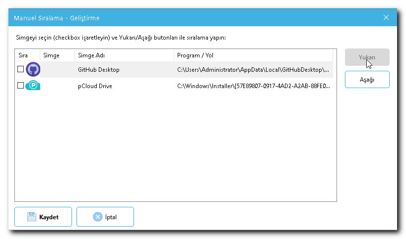

| Bileşen | Açıklama |
|---|---|
| Öğe Listesi | Sekmedeki tüm öğeler sırayla listelenir |
| Checkbox | Taşınacak öğeyi seçmek için işaretleyin |
| Yukarı | Seçili öğeyi bir üst sıraya taşır |
| Aşağı | Seçili öğeyi bir alt sıraya taşır |
| Kaydet ve Çık | Yeni sıralamayı kaydeder, pencereyi kapatır |
| İptal | Değişiklikleri iptal eder, pencereyi kapatır |

### Liste Sütunları

| Sütun | Açıklama |
|---|---|
| Sıra | Mevcut sıra numarası |
| Simge | Öğünün ikonu |
| Simge Adı | Öğünün adı |
| Program / Yol | Dosya veya uygulamanın tam yolu |

### Kullanım Adımları

1. Sıralama -> Manuel Sıralama... yi açın
2. Taşmak istediğiniz öğünün checkbox'ını işaretleyin
3. Yukarı veya Aşağı ile istediğiniz konuma taşıyın
4. Kaydet ve Çık'a tıklayın

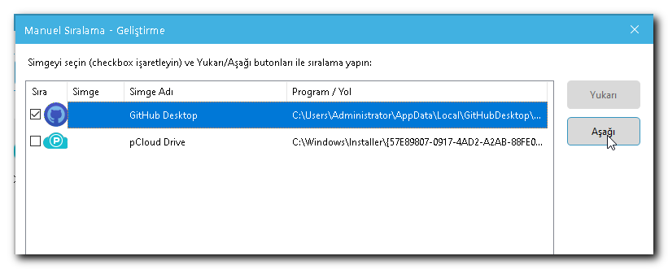

> NOT: İptal'e basarsanız yaptığınız değişiklikler kaydedilmez.

---

## Kopyala-Taşı Ekranı

Öğeleri sekmeler arasında kopyalayın veya taşıyın.

Açmak için: Öğeye sağ tıklayın -> Kopyala/Taşı...

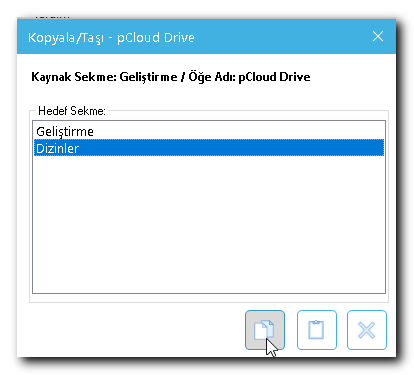

### Ekran Bileşenleri

| Bileşen | Açıklama |
|---|---|
| Başlık | "Kopyala/Taşı - [Öğe Adı]" |
| Kaynak Bilgisi | "Kaynak Sekme: X / Öğe Adı: Y" |
| Hedef Sekme | Açılır listeden hedef sekme seçin |
| Kopyala | Öğeyi kopyalar (kaynakta kalır) |
| Taşı | Öğeyi taşır (kaynaktan silinir) |
| İptal | İşlemi iptal eder |

### Kopyalama

1. Öğeye sağ tıklayın -> Kopyala/Taşı...
2. Hedef sekmeyi seçin
3. Kopyala'ya tıklayın -> Öğe her iki sekmede de görünür

### Taşıma

1. Öğeye sağ tıklayın -> Kopyala/Taşı...
2. Hedef sekmeyi seçin
3. Taşı'ya tıklayın -> Öğe kaynak sekmeden kaldırılır, hedefe eklenir

> NOT: Öğeyi aynı sekmeye taşımaya çalışırsanız uyarı mesajı alırsınız.

---

## Ayarlar Ekranı

Açmak için: Menü -> Ayarlar

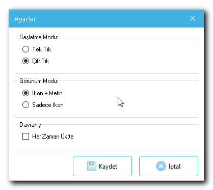

### Başlatma Modu

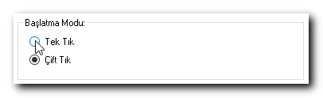

```
Başlatma Modu:
  o Tek Tik
  * Çift Tik   <- Varsayılan
```

| Seçenek | Davranış |
|---|---|
| Tek Tik | Bir kez tıklamak uygulamayı başlatır |
| Çift Tik | Çift tıklamak uygulamayı başlatır |

### Görünüm Modu

```
Görünüm Modu:
  * İkon + Metin   <- Varsayılan
  o Sadece İkon
```

| Seçenek | Davranış |
|---|---|
| İkon + Metin | İkonun altında öğe adı görünür |
| Sadece İkon | Yalnızca ikon görünür, daha kompakt |

### Her Zaman Üstte

```
[x] Her Zaman Üstte
```

İşaretlendiğinde WinLauncher diğer tüm pencerelerin üzerinde görünür.

### Kaydetme

Kaydet'e tıklayın. Ayarlar settings.ini dosyasına kaydedilir.

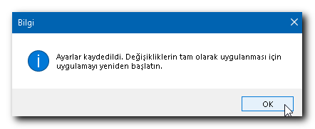

---

## Araçlar Menüsü

Açmak için: Menü -> Araçlar

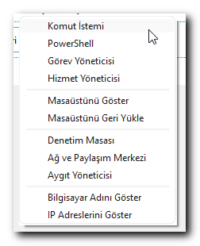

### Sistem Araçları

| Araç | Açıklama |
|---|---|
| Komut İstemi | cmd.exe açar |
| PowerShell | powershell.exe açar |
| Görev Yöneticisi | taskmgr.exe açar |
| Hizmet Yöneticisi | services.msc açar |
| Denetim Masası | control.exe açar |
| Ağ ve Paylaşım Merkezi | Windows Ağ Merkezi açar |
| Aygıt Yöneticisi | devmgmt.msc açar |

### Masaüstü Araçları

| Araç | Açıklama |
|---|---|
| Masaüstünü Göster | Tüm pencereleri minimize eder |
| Masaüstünü Geri Yükle | Explorer yeniden başlatılır |

### Bilgi Araçları

| Araç | Açıklama |
|---|---|
| Bilgisayar Adını Göster | PC adını gösterir, panoya kopyalar |
| IP Adreslerini Göster | Yerel ve uzak IP adreslerini gösterir, panoya kopyalar |

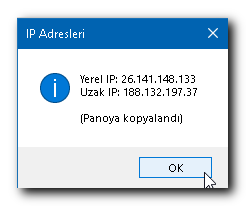

---

## Yardım Menüsü

Açmak için: Menü -> Yardım

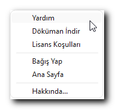

| Alt Menü | Açıklama |
|---|---|
| Yardım | Yardım bilgisi |
| Dokuman İndir | Aktif dile göre kılavuzu açar |
| Lisans Koşulları | Lisans detay ekranını açar |
| Bağış Yap | GitHub Sponsors sayfasına yönlendirir |
| Ana Sayfa | Projenin GitHub sayfasını açar |
| Hakkında... | Hakkında ekranını açar |

---

## Hakkında Ekranı

Açmak için: Menü -> Yardım -> Hakkında...

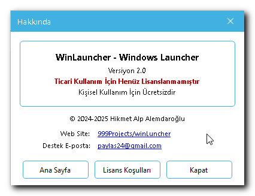

| Alan | İçerik |
|---|---|
| Uygulama Adı | WinLauncher - Windows Launcher |
| Sürüm | Version 2.0 |
| Lisans Durumu | Ticari Kullanım İçin Henüz Lisanslanmamıştır |
| Kullanım | Kişisel Kullanım İçin Ücretsizdir |
| Telif Hakkı | 2024-2025 Hikmet Alp Alemdaroğlu |
| Web Sitesi | Tıklanabilir bağlantı |
| Destek E-posta | Tıklanabilir e-posta adresi |

### Butonlar

| Buton | İşlev |
|---|---|
| Ana Sayfa | GitHub proje sayfasını tarayıcıda açar |
| Lisans Koşulları | Lisans detay ekranını açar |
| Kapat | Pencereyi kapatır |

---

## Lisans Ekranı

Açmak için:
- Menü -> Yardım -> Lisans Koşulları
- Hakkında ekranı -> Lisans Koşulları butonu

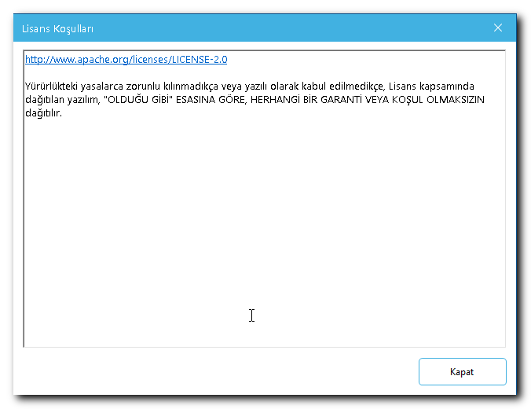

- Aktif dile göre otomatik yüklenir (TR -> license_tr.txt, EN -> license_en.txt)
- Salt okunur - düzenlenemez
- Dikey kaydırma ile tüm metin okunabilir
- Kapat butonu ile pencere kapatılır

---

## Dil Desteği

### Dil Değiştirme

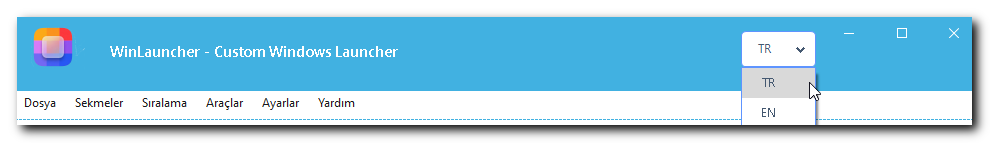

1. Başlık çubuğundaki dil açılır menüsünden (TR / EN) dili seçin
2. Tüm menüler, butonlar ve mesajlar anında değişir
3. Seçim settings.ini dosyasına otomatik kaydedilir
4. Program yeniden başlatıldığında aynı dil aktif kalır

### Dil Dosyası Özelleştirme

assets/lang.ini dosyasını bir metin editörüyle düzenleyerek:
- Mevcut çevirileri değiştirebilirsiniz
- Yeni bir dil ekleyebilirsiniz (örn: [de], [fr])

---

## İpuçları ve Yedekleme

### Sekme Organizasyonu Önerileri

```
Geliştirme   - VS Code, Git, Terminal, Postman
Oyunlar      - Steam, Epic Games, oyun kısayolları
İş           - Office, e-posta, iş uygulamaları
Tasarım      - Photoshop, Figma, Illustrator
Sistem       - Disk temizleme, antivirus, araçlar
Multimedya   - VLC, Spotify, fotoğraf görüntüleyici
```

### İkon İpuçları

- .ico dosyaları en iyi kaliteyi verir
- 128x128 veya 256x256 piksel boyut idealdir
- Hazır ikonlar assets/icon/ klasöründe bulunur
- Son kullanılan ikon klasörü otomatik hatırlanır

### Önemli Dosyaları Yedekleyin

```
winLuncher/
  Data/WinLauncher.xml    <- TÜM VERİLERİNİZ
  settings.ini            <- TÜM AYARLARINIZ
  assets/icon/            <- ÖZEL İKONLARINIZ
```

> Bu üç konumu düzenli aralıklarla yedekleyin!

### Taşınabilir Kullanım (USB)

1. Tüm winLuncher/ klasörünü USB belleğe kopyalayın
2. winLuncher.exe'yi doğrudan USB'den çalıştırın
3. Tüm ayarlar ve veriler USB'de saklanır
4. Farklı bilgisayarlarda aynı deneyim

---

## SSS

**S: Program açılmıyor, ne yapmalıyım?**
.NET Framework 4.7.2 veya üzerinin kurulu olduğundan emin olun.

**S: Öğe ekledim ama ikonlar görünmüyor?**
assets/icon/ klasörünün var olduğunu kontrol edin. Öğeye sağ tıklayıp İkonunu Değiştir ile manuel ikon atayabilirsiniz.

**S: XML yükleme hatası alıyorum?**
Data/WinLauncher.xml dosyasını silin; program bir sonraki açılışta yeni bir tane oluşturur. NOT: Mevcut verileriniz kaybolur, önce yedekleyin.

**S: Dil değiştirdim ama bazı öğeler eski dilde?**
Programı kapatıp yeniden açın.

**S: Yanlışlıkla öğe sildim, geri alabilirim mi?**
Hayır. Bu yüzden WinLauncher.xml dosyasını düzenli yedekleyin.

**S: Aynı uygulamayı birden fazla sekmeye ekleyebilir miyim?**
Evet. Öğeye sağ tıklayın -> Kopyala/Taşı -> Kopyala.

**S: Ayarlarım kaydedilmiyor?**
Programın bulunduğu klasöre yazma izniniz olduğundan emin olun.

**S: Yeni bir dil ekleyebilir miyim?**
Evet. assets/lang.ini dosyasına yeni bir [dilkodu] bölümü ekleyin (örn: [de]).

---

## Teknik Destek

| Kanal | Adres |
|---|---|
| Hata Bildirimi | https://github.com/hikmetalemdaroglu/999Projects/issues |
| Proje Sayfası | https://github.com/hikmetalemdaroglu/999Projects |
| E-posta | paylas24@gmail.com |

Bağış: https://github.com/sponsors/hikmetalemdaroglu

---

## Sürüm Notları

### v2.0 (2025)
- Tam çok dil desteği (TR / EN) - tüm ekranlar, menüler, mesajlar
- Lisans Detay Ekranı (LicenseDetForm)
- 13 adet sistem aracı (Araçlar menüsü)
- Manuel Sıralama ekranı
- Kopyala / Taşı ekranı
- IP ve bilgisayar adı gösterimci
- Hakkında ekranı
- Gelişmiş Ayarlar formu
- Dil değiştiğinde tüm butonlar anında güncellenir

### v1.3 (2025)
- LanguageManager altyapısı
- TR / EN menü çevirileri

### v1.2 (2024)
- Manuel sıralama, Kopyala/Taşı, İkon değiştirme

### v1.0 (2024)
- İlk sürüm, temel özellikler

---

Son Güncelleme: 2025 | Versiyon: 2.0 | 2024-2025 Hikmet Alemdaroğlu
